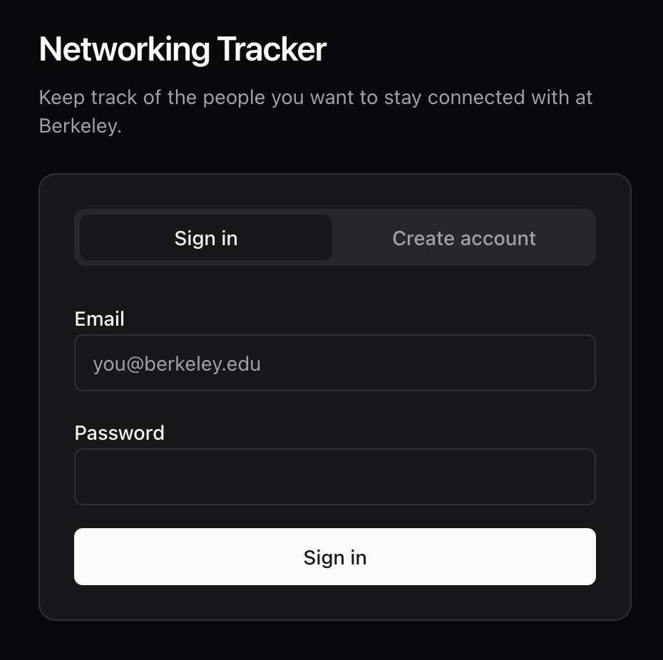
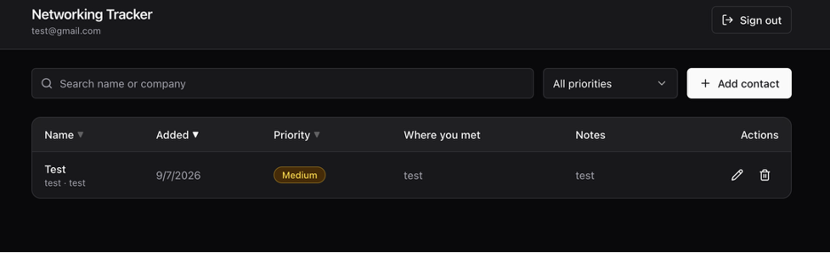
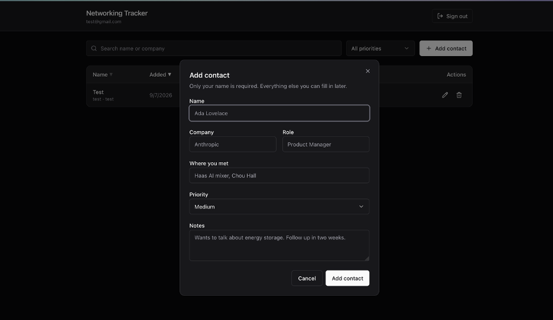
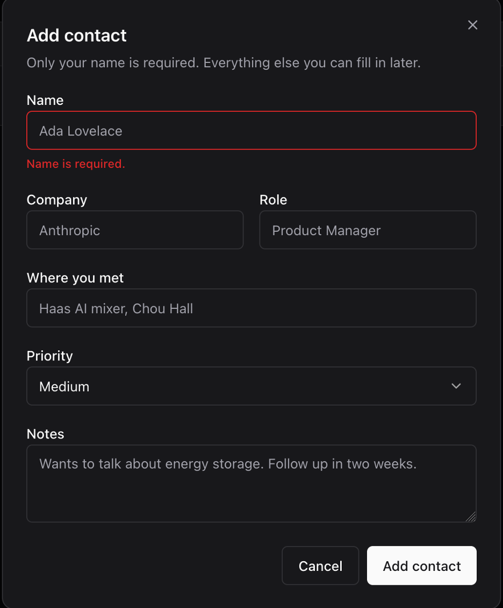
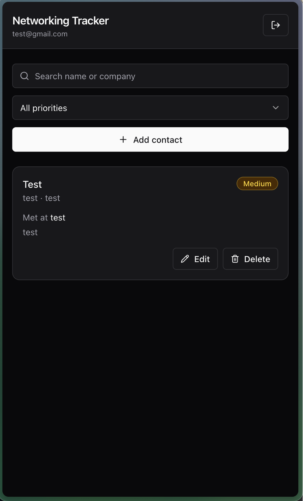
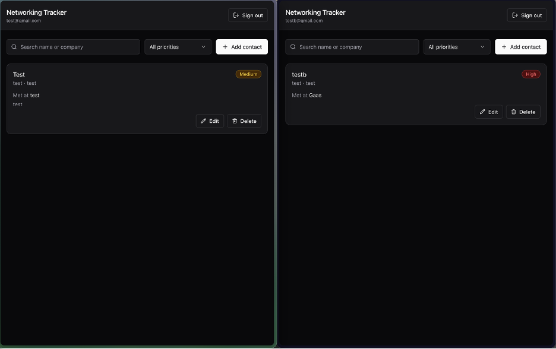

# Networking Tracker

A private networking tracker for the people you want to stay connected with at
Berkeley. You sign in, add the people you have met — their company, role, where
you met them, notes, and how much of a priority they are — and sort, filter, and
edit that list from a phone or a laptop. Every contact belongs to exactly one
account, and that ownership is enforced by Postgres itself through Row Level
Security rather than by application code, so a bug in the API cannot expose one
user's contacts to another.

**Live app:** https://networking-tracker-navy.vercel.app

---

## Contents

- [Screenshots](#screenshots)
- [Features](#features)
- [Technology stack](#technology-stack-and-why)
- [Architecture](#architecture)
- [Local setup](#local-setup)
- [Environment variables](#environment-variables)
- [Database schema](#database-schema)
- [Authentication and RLS ownership](#authentication-and-rls-ownership)
- [Tests](#tests)
- [Deployment](#deployment)
- [Grading evidence](#grading-evidence)
- [Known limitations](#known-limitations)

---

## Screenshots

| | |
|---|---|
| Sign in |  |
| Contact list |  |
| Add a contact |  |
| Invalid input fails safely |  |
| Mobile layout |  |
| Two accounts, isolated data |  |

---

## Features

- Email and password sign-up, sign-in, and sign-out via Neon Managed Better Auth
- A private contact list per account — name, company, role, where you met, notes, priority
- Priority is constrained to `high`, `medium`, or `low` in the database, not just the UI
- Create, edit, and delete contacts, with a confirmation step before deleting
- Sort by name, date added, or priority, in either direction
- Filter by priority and search across name and company
- Sorting, filtering, and searching all run in Postgres, not in the browser
- Contacts persist across refresh, sign-out, and device — they live in Neon Postgres
- Distinct loading, empty, no-results, error, and success states
- Responsive: a table on desktop, stacked cards on mobile
- Light and dark themes, following the operating system setting
- Keyboard accessible, with labelled fields and errors announced to screen readers

---

## Technology stack and why

| Layer | Choice | Why |
|---|---|---|
| Frontend | React 19 + Vite + TypeScript | The assignment calls for React. Vite gives a fast dev server and a plain static build, which is all the frontend needs to be. |
| Styling | Tailwind CSS v4 + shadcn/ui conventions | The assignment requires a design system. Tailwind v4 needs no config file, and the shadcn/ui pattern — Radix primitives for behaviour, CVA for variants, component source owned in-repo — means accessible dialogs and selects without a heavyweight dependency. |
| Backend | Node + Express 5 | The assignment calls for Node. Express 5 is small enough to read end to end and runs unmodified both as a local process and as a Vercel function. |
| Validation | Zod | One schema produces both the runtime check and the TypeScript type, so they cannot drift apart. |
| JWT verification | jose | The standard JOSE implementation for Node, with built-in remote JWKS fetching and caching. |
| Database | Neon Postgres | Required. Serverless Postgres with real RLS, which is what makes the security model work. |
| Auth | Neon Managed Better Auth | Required. Issues JWTs that both the Data API and this project's backend verify against the same JWKS. |
| Data access | Neon Data API (PostgREST) | Required. Every query runs as the signed-in Postgres role, so RLS applies to it. |
| Tests | `node --test` | Built into Node 26. No test framework to install, and no build step before running tests. |
| Hosting | Vercel | Required. Serves the static frontend and the Node function from one domain, so there is no CORS surface. |

---

## Architecture

```
┌──────────────────────┐
│  React SPA (Vite)    │  Browser
│  frontend/           │
└───────┬──────────────┘
        │ 1. sign in / sign up      ┌──────────────────────────┐
        ├──────────────────────────►│  Neon Managed Better Auth│
        │◄──────────────────────────┤  (public URL)            │
        │    JWT                    └──────────────────────────┘
        │
        │ 2. GET/POST/PATCH/DELETE /api/contacts
        │    Authorization: Bearer <JWT>
        ▼
┌──────────────────────┐
│  Express API         │  Vercel serverless function
│  backend/            │
│                      │  • verifies the JWT against Neon's JWKS
│                      │  • validates the body with Zod
│                      │  • holds no database credential
└───────┬──────────────┘
        │ 3. same user JWT forwarded
        ▼
┌──────────────────────┐
│  Neon Data API       │  PostgREST, runs as the `authenticated` role
└───────┬──────────────┘
        │ 4. auth.user_id() = the JWT's `sub` claim
        ▼
┌──────────────────────┐
│  Neon Postgres       │  RLS policies decide which rows exist for this user
│  contacts            │
└──────────────────────┘
```

**The browser never talks to the Data API.** The assignment permits it, and this
project deliberately does not do it. If the browser could write to the Data API
directly, then any validation in the backend would be advisory — a user could
simply skip it. Routing writes through our own API is what makes "validate in
trusted server code" a real guarantee rather than a convention.

**The backend holds no database credential.** There is no `DATABASE_URL` and no
service-role key in the deployed environment. Every query the API makes carries
the *caller's own* JWT, so Postgres evaluates the RLS policies as that user. If
a route handler forgot to filter by owner, the database would still return
nothing. `DATABASE_URL` is used exactly once, by a human, to paste
[`db/schema.sql`](db/schema.sql) into the Neon SQL Editor.

### Request flow, in words

1. The browser signs in against Neon Managed Better Auth and receives a session.
2. Before each API call it exchanges that session for a signed JWT (`GET /token`).
3. It calls our Express API with `Authorization: Bearer <JWT>`.
4. [`backend/src/auth.ts`](backend/src/auth.ts) verifies the signature against
   Neon's published JWKS, checks the issuer, and pulls `sub` out as the user id.
   An unsigned, edited, or expired token is rejected here with a 401.
5. [`backend/src/validation.ts`](backend/src/validation.ts) validates the body,
   dropping any `user_id` or `id` the client tried to supply.
6. [`backend/src/data.ts`](backend/src/data.ts) builds a Data API client whose
   `getToken` returns that same JWT, and the query goes out as that user.
7. Postgres applies the RLS policy for the operation and returns only rows the
   user owns.

### Layout

```
frontend/src/
  lib/auth.ts       Neon Auth client; exchanges a session for a JWT
  lib/api.ts        every call to our own backend; owns error wording
  lib/session.ts    useSession(): who is signed in
  components/ui/    shadcn/ui-style primitives (button, dialog, select, …)
  components/       ContactDialog, ContactList, States
  pages/            SignIn, Contacts
backend/src/
  app.ts            the Express app, with no listener attached
  server.ts         local dev entry point
  auth.ts           requireUser — JWKS verification
  validation.ts     Zod schemas and query normalisation  ← unit tested
  data.ts           per-request Data API client, error mapping
  routes/contacts.ts CRUD
api/index.ts        Vercel function entry; re-exports the Express app
db/schema.sql       table, constraints, RLS policies, grants
```

---

## Local setup

Requires Node 22 or newer (this was built on Node 26; the backend relies on
Node's native TypeScript type stripping, so there is no build step for the API).

```bash
git clone https://github.com/Geromola/networking-tracker.git
cd networking-tracker
npm install
cp .env.example .env.local
```

Fill in `.env.local` with the values from your Neon project, then create the
schema by pasting [`db/schema.sql`](db/schema.sql) into the Neon SQL Editor and
running it.

Add `http://localhost:5173` to **Trusted origins** in the Neon Auth settings,
then start both halves:

```bash
npm run dev
```

The API listens on `http://localhost:3001` and the app on
`http://localhost:5173`, which proxies `/api` to the API — the same single-origin
arrangement Vercel serves in production, so there is no CORS configuration in
either environment.

---

## Environment variables

Names only. Real values live in `.env.local`, which is gitignored; see
[`.env.example`](.env.example) for the full template.

### Server-only — never sent to the browser

| Variable | Purpose |
|---|---|
| `NEON_AUTH_URL` | Managed Better Auth base URL. Used to build the JWKS URL and to check the token issuer. |
| `NEON_DATA_API_URL` | Neon Data API base URL. Only the backend calls it. |
| `NEON_AUTH_JWKS_URL` | Optional override. Defaults to `$NEON_AUTH_URL/.well-known/jwks.json`. |
| `DATABASE_URL` | Used **only** by a human running `db/schema.sql` in the Neon SQL Editor. It is not read by any code and is not set in Vercel. |

### Public — inlined into the browser bundle

| Variable | Purpose |
|---|---|
| `VITE_NEON_AUTH_URL` | Managed Better Auth base URL, so the browser can sign in. Public by design. |

### A note on the names in the assignment brief

The brief lists `NEXT_PUBLIC_NEON_AUTH_URL` and `NEXT_PUBLIC_NEON_DATA_API_URL`.
This project is a Vite single-page app rather than a Next.js app, and Vite only
exposes variables prefixed with `VITE_` to the browser, so the public auth URL
is named `VITE_NEON_AUTH_URL`. Same value, different prefix.

There is deliberately **no public Data API URL**. The browser never calls the
Data API, so exposing its URL would widen the attack surface for no benefit.
This is a tightening of the requirement, not an omission.

---

## Database schema

Full definition in [`db/schema.sql`](db/schema.sql).

### `contacts`

| Column | Type | Constraints | Notes |
|---|---|---|---|
| `id` | `uuid` | primary key, `default gen_random_uuid()` | |
| `user_id` | `text` | **not null**, `default (auth.user_id())` | The owner. Filled in by the database from the JWT, never sent by a client. |
| `name` | `text` | not null, `length(btrim(name)) > 0`, `<= 200` | `btrim` first, so `"   "` is an empty name. |
| `company` | `text` | nullable, `<= 200` | |
| `role` | `text` | nullable, `<= 200` | |
| `where_met` | `text` | nullable, `<= 300` | |
| `notes` | `text` | nullable, `<= 5000` | |
| `priority` | `text` | not null, `default 'medium'`, `in ('high','medium','low')` | |
| `priority_rank` | `int` | generated, stored | `high→1, medium→2, low→3`. Sorting on the text column would give high, low, medium. |
| `created_at` | `timestamptz` | not null, `default now()` | |
| `updated_at` | `timestamptz` | not null, `default now()` | Maintained by a trigger, so a client cannot backdate it. |

Indexes: `(user_id, priority_rank, created_at desc)` and `(user_id, name)` —
every query is "my contacts, in some order", so both lead with `user_id`.

---

## Authentication and RLS ownership

### The ownership rule

Every policy compares `auth.user_id()` — the `sub` claim of the JWT on the
current request — against the row's `user_id` column.

```sql
alter table contacts enable row level security;

create policy contacts_select on contacts
  for select to authenticated
  using (auth.user_id() = user_id);

create policy contacts_insert on contacts
  for insert to authenticated
  with check (auth.user_id() = user_id);

create policy contacts_update on contacts
  for update to authenticated
  using (auth.user_id() = user_id)
  with check (auth.user_id() = user_id);

create policy contacts_delete on contacts
  for delete to authenticated
  using (auth.user_id() = user_id);
```

`USING` and `WITH CHECK` do different jobs, and the update policy needs both:

- `USING` decides which rows you are allowed to touch. It stops you editing
  somebody else's contact.
- `WITH CHECK` validates the row you are trying to leave behind. It stops you
  taking a contact you own and rewriting `user_id` to hand it to someone else.

An insert has no existing row to filter, so `contacts_insert` has only
`WITH CHECK`. A delete leaves no row behind, so `contacts_delete` has only
`USING`.

### Why a client cannot forge ownership

Three things would all have to fail at once:

1. `user_id` has `default (auth.user_id())`, and the API never sends the column.
2. Zod strips unknown keys, so a `user_id` in the request body is discarded
   before the query is built — this is asserted by a test.
3. Even if both were bypassed, `contacts_insert`'s `WITH CHECK` rejects any row
   whose `user_id` is not the caller's.

The `anonymous` role — which backs any request arriving without a valid JWT —
has every privilege revoked on `contacts`, so an unauthenticated request reads
nothing regardless of policies.

### Three layers of validation

| Layer | Where | Catches |
|---|---|---|
| Zod | `backend/src/validation.ts` | Bad input, with a message naming the field |
| `CHECK` constraints | `db/schema.sql` | Bad data arriving by any other path |
| RLS policies | `db/schema.sql` | Access to rows the caller does not own |

---

## Tests

```bash
npm test
```

Node's built-in test runner. Two tiers.

**Validation tests** (`backend/src/validation.test.ts`) — 17 tests, no network,
no credentials, so they pass on a fresh clone. They cover:

- an empty, missing, whitespace-only, or over-long name is rejected
- `priority` accepts only `high`, `medium`, `low`, and defaults to `medium`
- **a client-supplied `user_id` or `id` is stripped before it reaches the database**
- blank optional fields become `null` rather than `""`
- a `PATCH` carries only the keys the client sent, and an empty `PATCH` is refused
- an unknown sort column falls back to the default instead of being injected
- sorting by priority uses `priority_rank`, not the text column

**Two-user RLS test** (`backend/src/rls.test.ts`) — skipped unless the
`TEST_USER_*` variables are set. It signs in as two real accounts and talks to
the Neon Data API **directly**, bypassing this project's backend, so a pass
proves the database enforces ownership on its own:

- A creates a contact and the database stamps the owner
- B does not see it in a listing
- B cannot fetch it even knowing its exact `id`
- B cannot edit it, and A's copy is unchanged afterwards
- B cannot steal it by rewriting `user_id` (the `WITH CHECK` clause)
- B cannot delete it, and it still exists afterwards
- an unauthenticated request reads nothing

To run it, add the two accounts' credentials to `.env.local` and:

```bash
node --env-file=.env.local --test backend/src/rls.test.ts
```

### Output

```
$ npm test

✔ a missing name is rejected 
✔ an empty name is rejected 
✔ a whitespace-only name is rejected 
✔ a name longer than 200 characters is rejected 
✔ a valid name is trimmed and its inner whitespace collapsed 
✔ priority accepts exactly high, medium, and low 
✔ an invalid priority is rejected with a readable message 
✔ priority defaults to medium when omitted 
✔ a client-supplied user_id is stripped and never reaches the database 
✔ blank optional fields become null rather than empty strings 
✔ a patch only carries the keys the client actually sent 
✔ a patch that blanks the name is still rejected 
✔ an empty patch is rejected instead of issuing a no-op write 
✔ an unknown sort column falls back to the default instead of being injected 
✔ sorting by priority uses the rank column, not the text column 
✔ an unrecognized priority filter is dropped rather than applied 
✔ search is trimmed, and blank search means no filter 
ℹ tests 18
ℹ suites 0
ℹ pass 17
ℹ fail 0
ℹ cancelled 0
ℹ skipped 1
ℹ todo 0
ℹ duration_ms 173.518

(The one skipped test is the two-user RLS test, which runs once the
TEST_USER_* credentials are set. Its output is added below.)
```

---

## Deployment

The repo deploys as one Vercel project: Vite builds the SPA to
`frontend/dist`, and `api/index.ts` becomes a serverless function serving the
Express app. Both are on one domain, so there is no CORS configuration.

```bash
vercel link
vercel --prod
```

Vercel deploys this repo as **two services**, declared in
[`vercel.json`](vercel.json): `frontend` (a static Vite build) and `backend`
(a Node/Express service). Requests to `/api/*` are routed to the backend and
everything else to the frontend, so the two halves are genuinely separate
deployments that share one domain — which is why there is no CORS
configuration anywhere in the codebase.

The backend has its own `tsconfig.json` with `strict` enabled. This is not
optional: without strict mode TypeScript stops narrowing the
`{ ok: true } | { ok: false }` unions that `validation.ts` returns, and the
build fails on every call site that reads `.message` or `.fields`.

Then, in the Vercel project settings, add the environment variables:

| Variable | Environment |
|---|---|
| `NEON_AUTH_URL` | Production |
| `NEON_DATA_API_URL` | Production |
| `VITE_NEON_AUTH_URL` | Production |

`DATABASE_URL` is **not** set in Vercel. The application has no use for it, and
leaving it out means a compromised deployment still cannot bypass RLS.

Finally, add the deployed domain to **Trusted origins** in the Neon Auth
settings:

```
https://networking-tracker-navy.vercel.app
http://localhost:5173
```

**This step is not optional, and it fails in a misleading way.** Without it,
sign-up and sign-in on the deployed site fail with `Invalid origin` /
`Invalid callbackURL`, because Better Auth validates the callback URL the SDK
sends against the trusted-origins list.

Note that a CORS check will *not* catch this. The auth service happily returns
`access-control-allow-origin` for an untrusted origin, so a passing preflight
says nothing about whether sign-in will work. To test the real thing, send a
deliberately invalid sign-up and watch which error comes back — an origin
complaint means the domain is untrusted, an email complaint means it is fine:

```bash
curl -s -X POST "$NEON_AUTH_URL/sign-up/email" \
  -H "Content-Type: application/json" \
  -d '{"email":"not-an-email","password":"x","name":"probe",
       "callbackURL":"https://your-domain.vercel.app/"}'
```

Vercel also mints a fresh hostname for every deployment, so add a wildcard if
your Neon project supports one; otherwise only the stable alias will work.

---

## Grading evidence

| Requirement | Evidence |
|---|---|
| Automated test passes | [Test output](#output) |
| Sign in and sign out | `docs/01-sign-in.png` |
| Create, edit, delete, refresh | `docs/02-contacts.png`, `docs/03-add-contact.png` |
| User A cannot access User B's contacts | `docs/06-two-users.png` and `backend/src/rls.test.ts` |
| Invalid input fails safely | `docs/04-validation-error.png` |
| Schema and RLS explanation | [Authentication and RLS ownership](#authentication-and-rls-ownership) |
| No committed secrets | `.gitignore` excludes every `.env` variant except `.env.example`; only placeholder values are committed |

---

## Known limitations

- **Email and password only.** No OAuth providers, no password reset, and no
  email verification. Fine for a class project; not enough for real accounts.
- **No pagination.** Every contact is fetched on each query. Correct at
  personal-network scale, wrong at a few thousand rows.
- **The RLS test needs live credentials**, so CI on a fresh clone runs the
  validation tests only.
- **No optimistic UI.** Every mutation waits for the server and then re-queries.
  Simpler to reason about, but a little slower to feel.
- **No undo on delete.** Deletion is immediate and permanent behind a confirm
  dialog; a soft-delete column with a restore window would be kinder.
- **The JS bundle is around 700 kB** (200 kB gzipped), most of it the Neon auth
  SDK. Code-splitting the auth screen away from the contacts screen would cut
  what a signed-in user downloads.

### What I would do next

1. Soft delete with a restore window.
2. Pagination plus a full-text index once the list outgrows one screen.
3. Optimistic updates for edits and priority changes.
4. A "last contacted" date and a nudge when it gets stale — the feature that
   would make this genuinely useful rather than merely correct.
